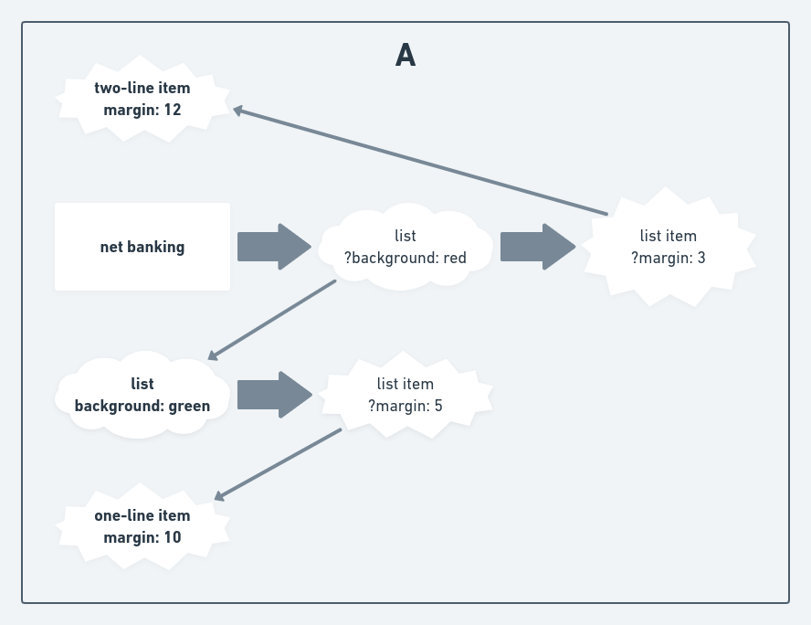
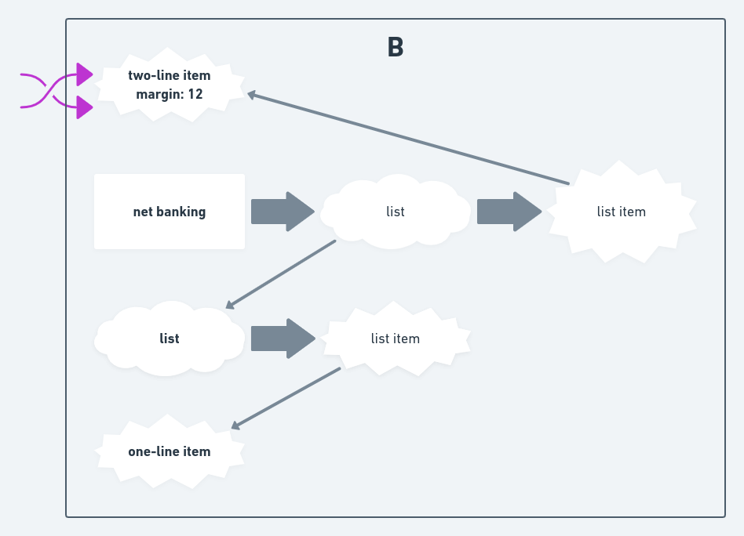
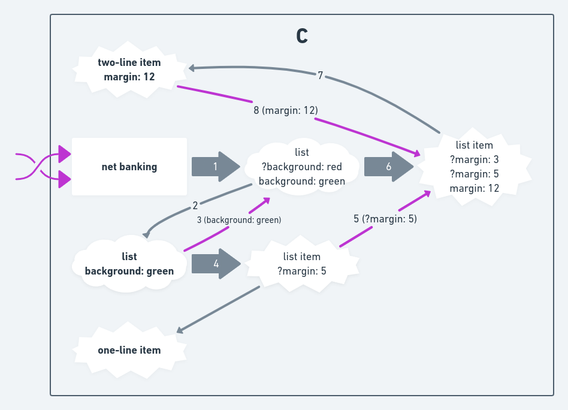
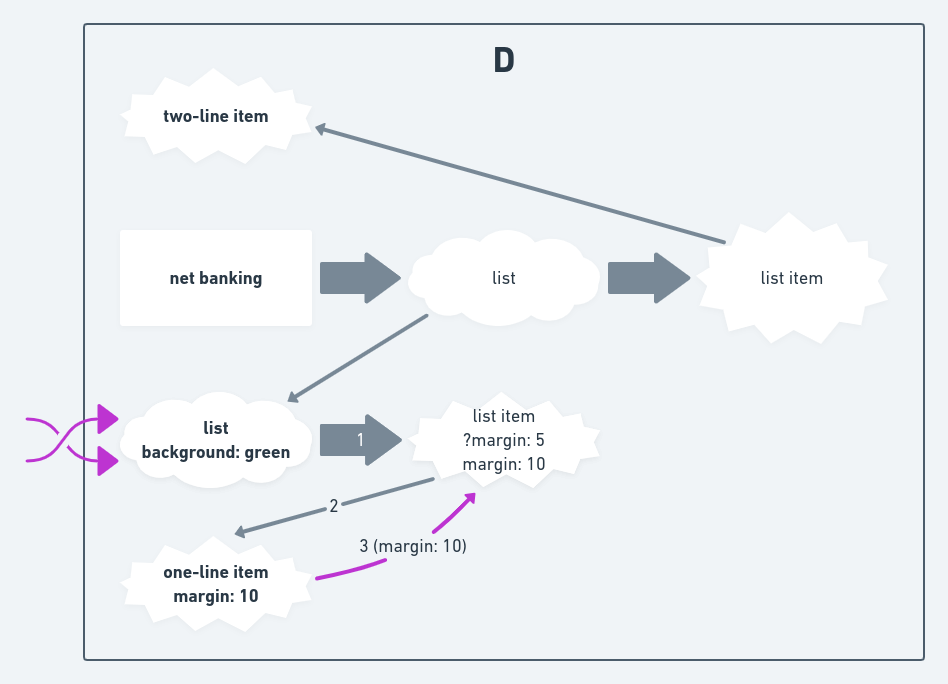
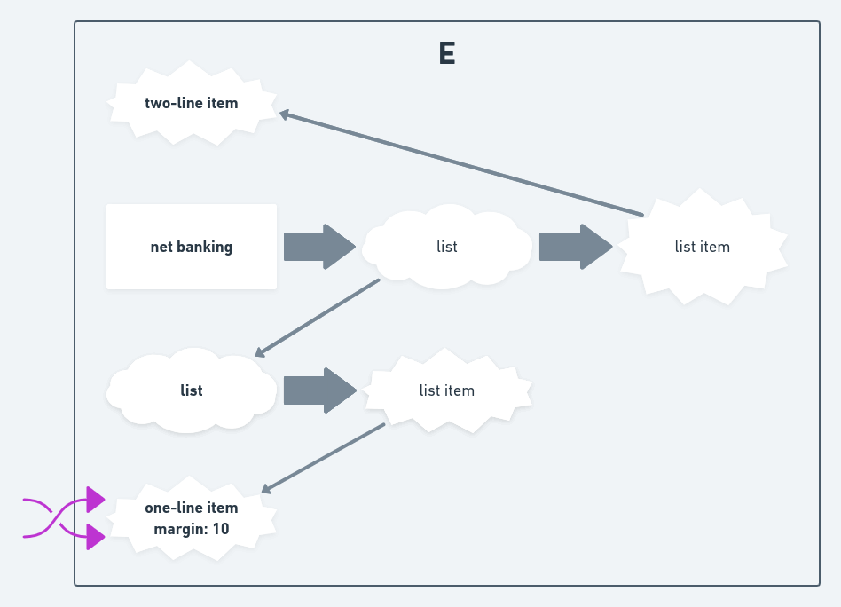

# hyper-widget-config

This repo is for utilities specific to handling merchant config of the payment page app.

- Definitions of the config data types - "raw" config type with unresolved references; and resolved config type where all references are resolved to actual values
- Resolve mechanism to resolve the references within the config given the default config
- Serialization mechanism to save/restore purescript types from config json, including the validation of the config file

# Install

```
npm install
```

# Build

```
npm run build
```

# Test

```
npm test
```

# Benchmark

```
npm run benchmark
```

or

```
npm run benchmark:optimized
```

to build optimized bundle and run benchmark on it.

# Contributing

See [CONTRIBUTING.md](./CONTRIBUTING.md)

# Documentation

## Overview

Project is split into:

- `src` contains main module source files
- `test` contains unit tests and property tests (not a single property test yet, but
  quickcheck library and its integration into test framework is already there). It uses `purescript-spec`
  framework with `purescript-spec-quickcheck` adapter. Since this project heavily relies on a lot of type-level
  programmings, there are a bunch of compile-time tests as well which go in the `test` directory, there are
  some utilities to help with those at `test/Prelude.purs`.
- `test_benchmark` contains benchmarks for common scenarios. It uses `purescript-benchotron` library
  which in turn uses `benchmark.js` javascript benchmarking framework under the hood. At `test_benchmark/Extra/Benchotron.purs`
  there are some utilities to prettify benchmark outputs for easier read on them.

See [CONTRIBUTING.md](./CONTRIBUTING.md) for explanation about module structure.

The main approach of the config handling here is an attempt to model config using data types that
represent it as accurately as possible even as it goes through the processing chain.
It provides nice benefits in terms of compile-time safety and robustness.

_(Unfortunately, it goes with downsides of enourmous code generated and terrible performance. Still, even if we decide to go with a more performant approach, this solution could be useful for property testing between two approaches as there are a lot of compile-time guarantees of its correctness)_

In practice it means heavy usage of the `purescript-heterogeneous` library which provides some convenient
utilities for working with heterogeneous structures. At `Extra.Heterogeneous` module there are a bunch of
utility functions to help with some common use-cases. They are also quite heavily unit-tested, and if you are
having troubles understanding the meaning of those utilities then taking a look at their example usage in the tests
is a good place to start.

To better represent the optional nature of the config (merchant can omit any of the properties) the
`SubRecord` type was introduced at `Data.SubRecord`. It is to denote a `Record` with possibly missing fields,
it is isomorphic to `Record` where each property value is wrapped within a `Nullable`. In fact, they even have the same
runtime representation and can be coerced from one to another (check `Data.SubRecord.Heterogeneous.Nullable`).

## Config Types

The config data types are defined at the `HyperWidgetConfig.Config.*` and are split in the directories according to how they
are defined in the config itself - `Components`, `Containers` and `Screens`. Later on they are combined into a single Config type
at the `HyperWidgetConfig.Config`.

For each of the component/container/screen there are several main type variations:

- `Props` corresponds to a value in the config that merchant provides. All `Props` are `SubRecord`s with optional states and references. In other words, everything is completely optional.
- `RequiredProps` corresponds to a minimal required configuration that is enough to fully resolve the config. More explicitly, it means that all "self props" for a component must be defined (at least as a `Reference`) and the default component reference for all subcomponents must be provided as well.
- `ResolvedComponentsProps` corresponds to config shape after resolving components references/overrides.
- `PropagatedStatesProps` corresponds to config shape after propagating states (merging base self props with provided partial states definitions).
- `ResolvedProps` corresponds to a case of a fully resolved config - when all overrides are resolved, all references are resolved, states are fully propagated for each of the possible state. This is a final ready to use version that you can have your component implementations to accept as input props.

There are also couple of types to help model component reference feature:

- `ReferenceProps` corresponds to how config references are represented. When there is a container that has a component, it specifies `ReferenceProps` as a type of that component prop. It differs from `Props` by having `component` prop in addition to normal "self props".
- `ReferenceResolvedProps` corresponds to `ReferenceProps` being fully resolved.

And couple of types to help model component states feature:

- `StateProps` corresponds to how component states are represented.
- `StateResolvedProps` corredsponds to `StateProps` being fully resolved.

`RequiredConfig` is the minimal data that we can use to fully resolve the entire config. The idea is that `RequiredConfig` is some kind of default config (either hardcoded, or fetched from the db for a particular merchant, doesn't matter) that should always be present. Then the merchant config is applied on top of this `RequiredConfig` and is resolved.

## Config Resolve chain

- TODO: Decode `.json` merchant config into `Props`
- Apply merchant config on top of `RequiredConfig`
- Resolve all component references _(when subcomponent of some container references another component)_. This requires some extra sub-steps:

  1. Convert the config data type into `ConfigTree` representation _(This is a homogeneous tree without any type parameters. It would be awesome to have it resolved using "default" heterogeneous approach but it doesn't look feasible, so it fallbacks to `ConfigTree`)_
  2. Resolve it with `ConfigTree`-specific resolve
  3. Convert `ConfigTree` back into heterogeneous representation

- Propagate "self props" into states props by filling in missing props in present states and copying unmentioned states
- Resolve all single-value references _(when some property of some component references another value like `"themeConfig.styling.margin"`)_
- Errors that appeared during resolve are reported with applicative validation `V`, so here they are aggregated throughout the config and if there are any, they are returned as an `Array ConfigError`
- Done

## Resolve Components


(mouse right-button click, select "Open image in new tab", here the image will be clickable to zoom)

### a



A - example initial configuration.

Here `?` in `?background` and `?margin` indicate possibility of missing values.

White squares indicate screens.

White "clouds" indicate containers.

White "hedgehog-like-things" indicate components.

### b



B - resolving `two-line item` component.

This is a component without subcomponents, nothing to do.

### c



C - resolving `net banking` screen.

1. Go to `list` override for `net banking` screen
2. Check where `list` points to, go there
3. Fill missing properties in `list` from `list` container definition
4. Go to `list item` override for `list` container definition
5. Fill missing properties in `net banking : list : list item` from `list : list item`
6. `list` override is resolved, now go to components override of `list` container in the `net banking` screen
7. Check where `list item` override points to, go there
8. Fill missing properties in `net banking : list : list item` from `two-line item`

### d



D - resolving `list` container.

1. Go to `list item` override for `list` container
2. Check where `list item` points to, go there
3. Fill missing properties in `list item` from `one-line item`

### e



E - resolving `one-line item` component.

This is a component without subcomponents, nothing to do.

### f


F - final configuration after resolve.

If one of the `?prop` properties is missing, next one is applied.
# hyper-config
